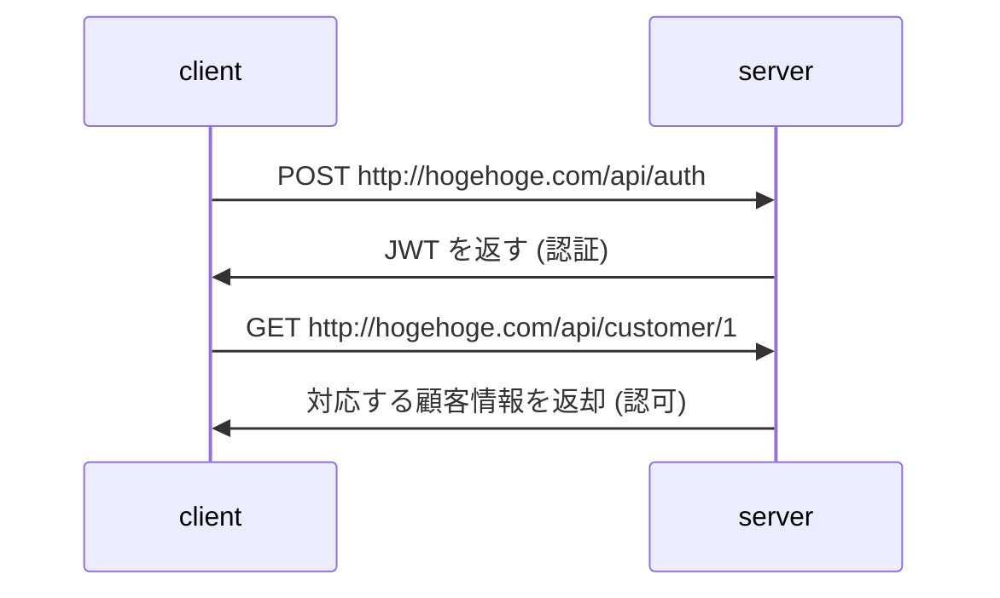

# Go（Gin）

## 環境構築


1. Go MODファイルの作成  
依存管理をするためのファイル
このプロジェクトはこのパッケージを使ってますよみたいなことを管理する

    ```ssh
    ❯ go mod init main
    ```

2. Go MODファイルの作成  
依存管理をするためのファイル
このプロジェクトはこのパッケージを使ってますよみたいなことを管理する

    ```ssh
    ❯ go get gopkg.in/yaml.v3
    ```

3. Go MODファイルの作成  
依存管理をするためのファイル  
このプロジェクトはこのパッケージを使ってますよみたいなことを管理する

    ```ssh
    ❯ go get -u github.com/gin-gonic/gin
    ```


## REST API(REpresentational State Transfer)

基本的に**ステートレス**.

REST の基本は
- データの取得: HTTP GET
- データの新規作成: HTTP POST
- データの更新: HTTP PUT/PATCH
- データの削除: HTTP DELETE

※ やり取りするデータは基本JSONでIDをパスパラメータで指定することが多い。

全件取得はGETで各リソースに対応するベースエンドポイントにリクエストを送信する。
この時データが多い場合で、ページネーションを実現するときはクエリパラメータにページやソーティングのオプションを与えたりする

作成に成功した場合は 201、取得に成功した場合は 200 等処理状態に合わせてHTTPのステータスコードを割り振る。
エラーが発生した場合は、それにあったステータスコードを振る。


### 例

顧客情報を管理するシステムがあるとして、 `hogehoge.com/customer` 配下で REST APIを提供しているとする


- 顧客情報の一覧取得
    - `GET hogehoge.com/customer`
- 顧客情報の取得
    - `GET hogehoge.com/customer/{customerId}`
- 顧客情報の新規作成
    - `POST hogehoge.com/customer/`
- 顧客情報の更新
    - `PUT hogehoge.com/customer/{customerId}`
- 顧客情報の削除
    - `DELETE hogehoge.com/customer/{customerId}`


## 認証機能の実現方法

RESTは基本的にステートレスでセッションを持たない。

認証は基本的には、JWTを使って行われることが多い。

従来のMPA的なアプリケーヨンお場合は、セッション認証機能を持たせて、リソースアクセスを認可しているがRESTはそういうことができない。

JWT（JSON WEB TOKEN）を使って認可を行う

[jwt](https://jwt.io)
暗号化されているわけではないので注意

JWTは暗号化されていないただのbase64でエンコードされているJSONデータ。

絶対にパスワードや口座情報等重要なデータを打ち込まない。せいぜい内部的なユーザIDぐらい。

JWTは署名に利用されているアルゴリズム、JSONデータ、署名キーの3つで構成されていて、署名のチェックを行うことで**改ざんされていないかのチェックを行う**。このあたりがちゃんと実装できていないとセブンペイみたいになるよ。


### 流れ



認証時に発行されたアクセストークン(JWT)を適当にリソース要求時にリクエストに付加する。

※一般的にはHTTPのヘッダー`Authorization` に `Bearer {token}` の形で付加することが多い。

トークンをどう保持するかはプロジェクト次第。メジャーなのは以下2つ。
- クッキーに保持する -> CSRF の脆弱性があると危険
- LocalStorageに保持する -> XSSの脆弱性があると危険

このあたりは、セキュリティにクリティカルに響くので、[Auth0](https://auth0.com/)使ったりAzureやAWSを使えるなら[Cognito](https://aws.amazon.com/jp/cognito/)みたいなのを使ったほうが無難。


エンドポイントはURLみたいなもの
RESTのパスをどういうふうに管理するのかの設定